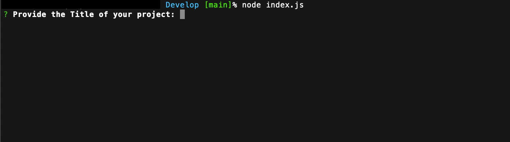

# CLI README Generator

## Description

This is a CLI application that helps people generate their README files with ease.

- I wanted to make this app to help people. I love helping people!
- I wanted to build this project to learn more about custom CLIs.
- This app will help developers maintain professional consistency with their README files.
- I learned that you can do lots in the terminal!

## Table of Contents

- [Installation](#installation)
- [Usage](#usage)
- [Credits](#credits)
- [Tests](#tests)
- [Questions](#questions)

## Installation

First, download or clone the project to your machine. Then, in Terminal, navigate to the Devlop folder and run 'node index.js'

## Usage

https://www.loom.com/share/4dbb347fe4834c60993f9479e84fd874?sid=12e59159-4162-49bd-bc76-0db951587c95
First, download or clone the project to your machine. Then, in Terminal, navigate to the Devlop folder and run 'node index.js'

## Credits

No collaborators on this project.

## Tests

No examples for testing. Sorry!

## Questions

- GitHub: [ryandarton](https://github.com/ryandarton)
- Email: ryandarton@gmail.com

## License

This project is licensed under the MIT license.

